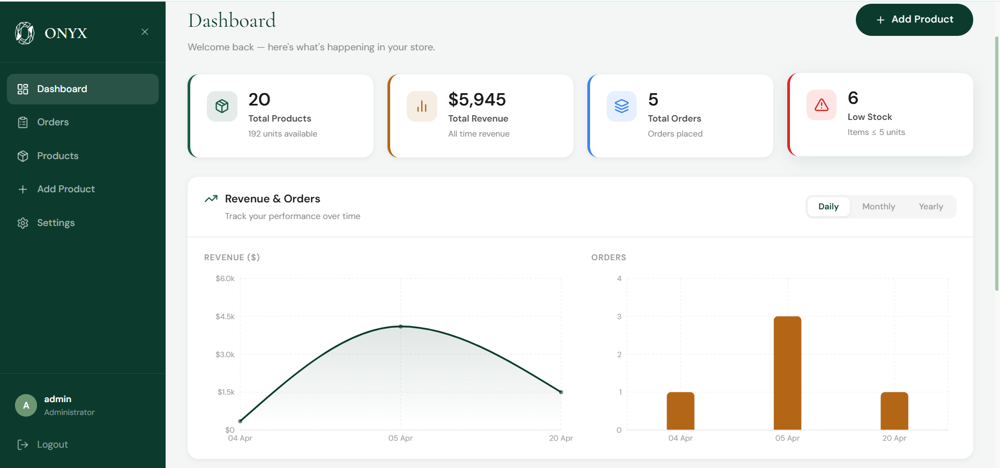

# 🛋️ Onyx — Premium Furniture Store

A full-stack furniture e-commerce application built with **FastAPI**, **React**, and **MySQL**. Designed with a premium aesthetic, featuring a seamless shopping experience, user accounts, and a robust admin dashboard.

<p align="center">
  
  
  
  
  
  
</p>

---

## 🌐 Live Demo

**[🔗 Visit Onyx Live Demo](https://onyx-theta-five.vercel.app/)**

> ⚠️ **Note:** The backend API is hosted on Render's free tier. It may take 1-2 minutes for the server to "wake up" after a period of inactivity. Please be patient when first loading the site!

---

## 📸 Screenshots

### Admin Dashboard



---

## ✨ Features

- **🛍️ Premium Shopping Experience**:
    - Smooth scroll-to-top navigation transitions with animated reveals.
    - Responsive, mobile-first design with high-end typography.
    - Category-based browsing and featured product carousels.
    - Real-time search and multi-filter (category, price, featured).
    - Detailed product pages with add-to-cart and favourites support.
- **🛒 Cart & Checkout**:
    - Persistent shopping cart with quantity management.
    - Checkout flow with order confirmation.
    - Full order history accessible from the user account.
- **❤️ Favourites**:
    - Save and manage favourite products across sessions.
- **👤 User Accounts**:
    - Customer registration and login (JWT-based).
    - Account dashboard with editable profile, order history, and favourites.
- **📬 Contact Page**:
    - Contact form with backend email-handling route.
- **🔐 Secure Admin Panel**:
    - JWT-based authentication for secure access.
    - Password visibility toggle on login for better UX.
    - Full product CRUD (Create, Read, Update, Delete) with image upload.
    - Order management view.
    - Site settings configuration.
    - Dashboard with live sales stats and category distribution charts.
- **🖼️ Media Handling**:
    - Image upload support (local `uploads/` storage + URL fallback).
    - Skeleton loading states for a polished feel.
- **📦 Pre-seeded Data**:
    - Comes with sample products across curated categories.

---

## 🛠️ Technology Stack

### Frontend
- **Framework**: React 18 (Vite)
- **Routing**: React Router DOM 6
- **Icons**: Lucide React
- **Animations**: CSS Transitions, Smooth Scroll API & custom scroll-reveal hooks
- **State/Auth**: Context API (AuthContext, CartContext, FavoritesContext)
- **Styling**: Vanilla CSS (Global Design System + CSS Modules per component)

### Backend
- **Framework**: FastAPI (Python 3.12+)
- **ORM**: SQLAlchemy 2.0
- **Authentication**: JWT (Jose) + Passlib (Bcrypt), Cookie-based sessions
- **Web Server**: Uvicorn / Gunicorn
- **Validation**: Pydantic v2
- **Rate Limiting**: Custom middleware (`core/rate_limit.py`)

---

## 📁 Project Structure

```
furniture-app/
├── backend/                        # FastAPI Python backend
│   ├── app/
│   │   ├── __init__.py
│   │   ├── core/                   # App infrastructure
│   │   │   ├── config.py           # Environment & app settings
│   │   │   ├── cookies.py          # Cookie helper utilities
│   │   │   ├── database.py         # SQLAlchemy engine & session
│   │   │   ├── rate_limit.py       # Rate limiting middleware
│   │   │   └── security.py         # JWT & password hashing
│   │   ├── models/                 # SQLAlchemy ORM models
│   │   │   ├── __init__.py
│   │   │   ├── admin.py            # Admin user model
│   │   │   ├── cart.py             # Cart & CartItem models
│   │   │   ├── favorite.py         # Favorite model
│   │   │   ├── order.py            # Order & OrderItem models
│   │   │   ├── product.py          # Product model
│   │   │   ├── site_settings.py    # Site settings model
│   │   │   └── user.py             # Customer user model
│   │   ├── routers/                # API route handlers
│   │   │   ├── __init__.py
│   │   │   ├── auth.py             # Admin & user auth endpoints
│   │   │   ├── cart.py             # Cart management endpoints
│   │   │   ├── contact.py          # Contact form endpoint
│   │   │   ├── favorites.py        # Favourites endpoints
│   │   │   ├── orders.py           # Order placement & history
│   │   │   ├── products.py         # Product CRUD & search
│   │   │   ├── settings.py         # Site settings endpoints
│   │   │   └── users.py            # User profile endpoints
│   │   └── schemas/                # Pydantic validation schemas
│   │       ├── __init__.py
│   │       └── schemas.py
│   ├── uploads/                    # Uploaded product images (local)
│   ├── main.py                     # FastAPI application entry point
│   ├── seed.py                     # Database seeder (sample data)
│   └── requirements.txt
│
└── frontend/                       # React + Vite frontend
    ├── src/
    │   ├── App.jsx                 # Root component & route definitions
    │   ├── main.jsx                # React DOM entry point
    │   ├── assets/
    │   │   ├── images/             # Static image assets
    │   │   └── styles/
    │   │       └── globals.css     # Global CSS design system & tokens
    │   ├── components/
    │   │   ├── admin/
    │   │   │   ├── AdminLayout.jsx         # Admin sidebar & shell
    │   │   │   ├── AdminLayout.module.css
    │   │   │   └── ProtectedRoute.jsx      # Auth guard for admin routes
    │   │   ├── shop/
    │   │   │   ├── Footer.jsx              # Site footer
    │   │   │   ├── Footer.module.css
    │   │   │   ├── Navbar.jsx              # Main navigation bar
    │   │   │   ├── Navbar.module.css
    │   │   │   ├── ProductCard.jsx         # Reusable product card
    │   │   │   ├── ProductCard.module.css
    │   │   │   └── ShopLayout.jsx          # Shop page wrapper
    │   │   └── ui/
    │   │       ├── FeaturesCarousel.jsx    # Home features carousel
    │   │       ├── FeaturesCarousel.module.css
    │   │       ├── Pagination.jsx          # Paginator component
    │   │       ├── Pagination.module.css
    │   │       ├── SkeletonCard.jsx        # Loading skeleton card
    │   │       ├── SkeletonCard.module.css
    │   │       ├── Threads.jsx             # Animated thread background
    │   │       └── Threads.css
    │   ├── context/
    │   │   ├── AuthContext.jsx     # Auth state (admin & user sessions)
    │   │   ├── CartContext.jsx     # Cart state management
    │   │   └── FavoritesContext.jsx # Favourites state management
    │   ├── hooks/
    │   │   ├── useProducts.js          # Product fetching & filtering hook
    │   │   ├── useScrollReveal.js      # Single-element scroll reveal hook
    │   │   └── useScrollRevealCards.js # Cards scroll reveal animation hook
    │   ├── lib/                    # (Reserved for future utilities)
    │   ├── pages/
    │   │   ├── account/
    │   │   │   ├── AccountLayout.jsx   # Account section shell & nav
    │   │   │   ├── EditProfile.jsx     # Edit user profile page
    │   │   │   ├── Favorites.jsx       # User favourites page
    │   │   │   ├── OrderHistory.jsx    # User order history page
    │   │   │   └── Account.module.css
    │   │   ├── admin/
    │   │   │   ├── AdminDashboard.jsx      # Stats & charts dashboard
    │   │   │   ├── AdminDashboard.module.css
    │   │   │   ├── AdminLogin.jsx          # Admin login page
    │   │   │   ├── AdminLogin.module.css
    │   │   │   ├── AdminOrders.jsx         # Orders management view
    │   │   │   ├── AdminOrders.module.css
    │   │   │   ├── AdminProductForm.jsx    # Create/edit product form
    │   │   │   ├── AdminProductForm.module.css
    │   │   │   ├── AdminProducts.jsx       # Products list & management
    │   │   │   ├── AdminProducts.module.css
    │   │   │   ├── AdminSettings.jsx       # Site settings page
    │   │   │   └── AdminSettings.module.css
    │   │   ├── auth/
    │   │   │   ├── Login.jsx           # Customer login page
    │   │   │   ├── Signup.jsx          # Customer registration page
    │   │   │   └── Auth.module.css
    │   │   └── shop/
    │   │       ├── About.jsx               # About us page
    │   │       ├── About.module.css
    │   │       ├── Cart.jsx                # Shopping cart page
    │   │       ├── Cart.module.css
    │   │       ├── Checkout.jsx            # Checkout page
    │   │       ├── Checkout.module.css
    │   │       ├── Contact.jsx             # Contact page
    │   │       ├── Contact.module.css
    │   │       ├── Home.jsx                # Landing / home page
    │   │       ├── Home.module.css
    │   │       ├── OrderConfirmation.jsx   # Post-checkout confirmation
    │   │       ├── OrderConfirmation.module.css
    │   │       ├── ProductDetail.jsx       # Single product view
    │   │       ├── ProductDetail.module.css
    │   │       ├── Products.jsx            # Product catalogue / browse
    │   │       └── Products.module.css
    │   └── utils/
    │       └── api.js              # Axios instance & API helpers
    ├── index.html
    ├── vite.config.js
    ├── vercel.json                 # Vercel SPA routing config
    └── package.json
```

---

## 🚀 Local Quick Start

### 1. Database Setup
Ensure you have MySQL running and create the database:
```sql
CREATE DATABASE furniture_db CHARACTER SET utf8mb4 COLLATE utf8mb4_unicode_ci;
```

### 2. Backend Setup
```bash
cd backend
python -m venv venv
source venv/bin/activate  # Windows: venv\Scripts\activate

pip install -r requirements.txt
cp .env.example .env      # Configure your local DB credentials
python seed.py            # Initialize tables and sample data
uvicorn main:app --reload --port 8000
```
> API Docs: [http://localhost:8000/api/docs](http://localhost:8000/api/docs)

### 3. Frontend Setup
```bash
cd frontend
npm install
npm run dev
```
> App: [http://localhost:5173](http://localhost:5173)

## 🔑 Default Credentials (Local)

| Field    | Value      |
|----------|------------|
| Username | `admin`    |
| Password | `admin123` |

> ⚠️ **Caution**: Change these credentials immediately after deploying to a production environment.
